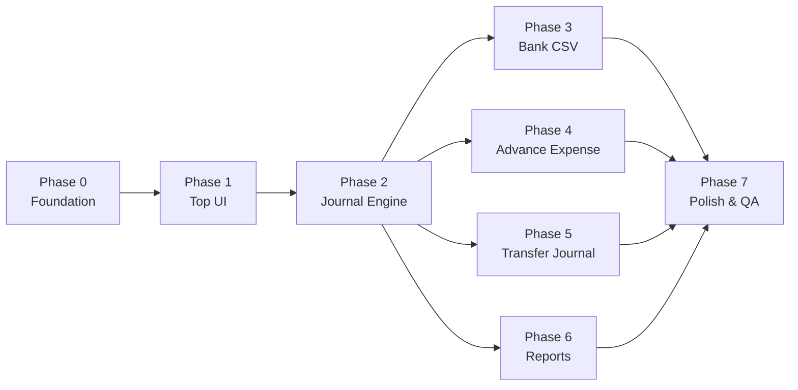
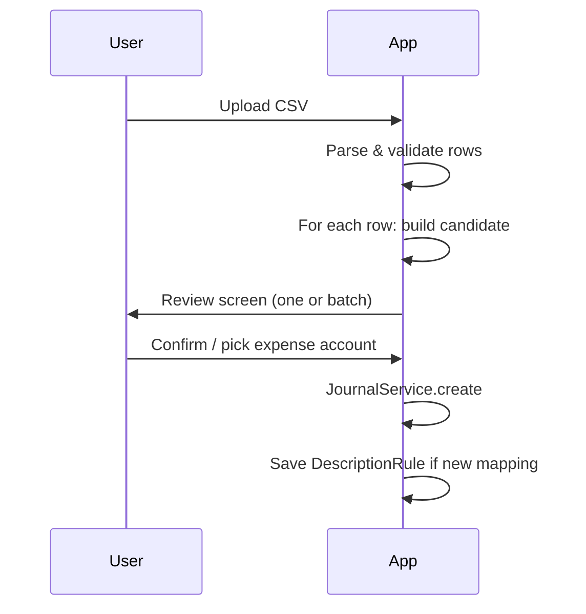

# Accounting Software MVP — Implementation Plan

This document breaks the full MVP (defined in `accounting-software-requirements.md`) into **8 phases**. Each phase is designed to be implementable in one or a few focused sessions, with clear deliverables and acceptance criteria.

---

## Current State

| Item | Status |
|------|--------|
| Tech stack | Laravel 12, Inertia.js, React 19, TypeScript, Tailwind CSS 4 |
| Auth | Login / register / password reset (starter kit) |
| Accounting features | **Not started** |
| Bank CSV | Use **mock CSV** until real samples are provided |

---

## Design Principles (carry through every phase)

1. **Hide debits/credits** — Users pick “入金 / 出金 / 経費科目”, not 借方・貸方.
2. **Fixed chart of accounts** — Only the accounts listed in the requirements; no free-form account creation in MVP.
3. **Minimal input** — Fewer fields than traditional accounting software.
4. **Annual period only** — No monthly closing in MVP.
5. **Consulting-first** — No SaaS billing; show company name and user name on mypage.

---

## Phase Overview



| Phase | Name | Goal | Depends on |
|-------|------|------|------------|
| 0 | Foundation | DB schema, accounts, company settings | — |
| 1 | Top UI & Navigation | 4-card home screen, layout | Phase 0 |
| 2 | Journal Engine | Create, list, validate journal entries | Phase 0 |
| 3 | Bank CSV Import | Mock CSV → auto journal candidates | Phase 2 |
| 4 | Advance Expense | 立替経費入力 | Phase 2 |
| 5 | Transfer Journal | 振替伝票 under その他 | Phase 2 |
| 6 | Financial Reports | PL, BS, ledgers, PDF/CSV | Phase 2 |
| 7 | Polish & QA | Consumption tax, edge cases, tests | Phases 3–6 |

---

## Phase 0 — Foundation (Data Model & Settings)

**Goal:** Persistent accounting data layer and master data so all later features share one source of truth.

### 0.1 Database schema

Create migrations for:

| Table | Purpose |
|-------|---------|
| `companies` | 社名, 代表者名, fiscal year start month |
| `fiscal_years` | `company_id`, `start_date`, `end_date`, `is_active` |
| `accounts` | Fixed chart: code, name, type (asset/liability/equity/revenue/expense) |
| `journal_entries` | Header: date, description, source (`bank_csv`, `advance_expense`, `transfer`, `manual`) |
| `journal_lines` | `journal_entry_id`, `account_id`, `debit`, `credit` |
| `description_rules` | 摘要 → suggested expense account (auto-learning) |
| `bank_imports` | Upload metadata, status, row count |
| `bank_import_rows` | Parsed CSV rows + link to `journal_entry_id` when confirmed |

**Rules:**
- Every journal entry must balance (sum debits = sum credits).
- One active fiscal year per company in MVP.
- `accounts` seeded once; users cannot add arbitrary accounts in MVP.

### 0.2 Seed data

Seed all accounts from requirements §7:

- **Revenue:** 売上高 (1)
- **Expense:** 会議費, 接待交際費, … 法人税、住民税及び事業税 (19)
- **Asset:** 預金, 売掛金, … 長期前払費用 (11)
- **Liability:** 買掛金, … 未払法人税等 (6)

Include 元入金 (or equity placeholder) if needed for opening balance — confirm with stakeholder before Phase 6 BS.

### 0.3 Models & relationships

- `Company` → `FiscalYear`, `JournalEntry`
- `JournalEntry` → `JournalLine` → `Account`
- `DescriptionRule` → `Account`

### 0.4 Settings API (minimal)

- Extend user profile or add `Company` linked to `User`.
- Endpoints/pages for: 社名, 代表者名, 会計期間（開始日・終了日）.
- Place under **その他 → 会計期間設定** (UI in Phase 1; logic here).

### Acceptance criteria

- [ ] Migrations run cleanly on SQLite/MySQL.
- [ ] Account seeder loads full fixed chart.
- [ ] Company + fiscal year can be saved and retrieved.
- [ ] PHPUnit: journal balance validation helper exists.

### Suggested files

```
database/migrations/xxxx_create_companies_table.php
database/migrations/xxxx_create_accounts_table.php
database/migrations/xxxx_create_journal_entries_table.php
database/migrations/xxxx_create_journal_lines_table.php
database/migrations/xxxx_create_description_rules_table.php
database/migrations/xxxx_create_bank_imports_table.php
database/seeders/AccountSeeder.php
app/Models/Company.php, Account.php, JournalEntry.php, JournalLine.php
app/Services/JournalService.php
```

---

## Phase 1 — Top UI & Navigation

**Goal:** Replace generic dashboard with the 4-item home screen from requirements §3.

### 1.1 Layout

- App shell: header with 社名 and user name (mypage).
- No complex accounting sidebar — only back-to-home navigation.

### 1.2 Home screen (トップ)

Four large cards / buttons:

| Label | Route (suggested) | Phase |
|-------|-------------------|-------|
| 銀行CSV取込 | `/bank-import` | 3 |
| 立替経費入力 | `/advance-expenses` | 4 |
| 決算書出力 | `/reports` | 6 |
| その他 | `/other` | 5 |

Disabled or “準備中” state for routes not yet built.

### 1.3 その他 submenu (shell only)

- 臨時仕訳（振替伝票）
- 固定資産登録 → **post-MVP** (show as disabled or omit)
- 勘定科目設定 → read-only list in MVP
- 会計期間設定 → from Phase 0

### Acceptance criteria

- [ ] Authenticated user lands on 4-card home after login.
- [ ] Company name visible in header.
- [ ] Mobile-friendly card layout.
- [ ] Routes registered; unimplemented pages show placeholder.

### Suggested files

```
resources/js/pages/home.tsx
resources/js/pages/other/index.tsx
resources/js/layouts/app-layout.tsx
routes/web.php
```

---

## Phase 2 — Journal Engine (Core)

**Goal:** Shared service for all features that create accounting entries. Must be solid before Phases 3–6.

### 2.1 JournalService

Responsibilities:

- `createBalancedEntry(date, description, lines[], source)`
- Validate: allowed accounts only, amounts > 0, debits = credits
- Assign entry to active fiscal year by date
- Prevent duplicate bank import rows (idempotency key)

### 2.2 Journal listing (internal/admin view)

Simple table: date, description, source, total amount. Used for debugging and 仕訳帳 data source.

### 2.3 Account query helpers

- `getExpenseAccounts()` — for dropdowns
- `getAccountByName('預金')`, `getAccountByName('売上高')`, etc.

### Acceptance criteria

- [ ] Can manually create a balanced entry via tinker/test.
- [ ] Unbalanced entry throws validation error.
- [ ] Entry outside fiscal year is rejected.
- [ ] Unit tests cover balance check and account whitelist.

### Suggested files

```
app/Services/JournalService.php
app/Http/Requests/StoreJournalEntryRequest.php
tests/Unit/JournalServiceTest.php
```

---

## Phase 3 — Bank CSV Import (銀行CSV取込)

**Goal:** Import mock corporate bank CSV, propose journals, confirm with minimal user input.

### 3.1 Mock CSV format (temporary)

Define a single canonical format until real bank samples arrive:

```csv
日付,摘要,入金額,出金額,残高
2025-04-01,振込 カ）ABC商事,100000,,1500000
2025-04-02,Amazon.co.jp,,5000,1495000
```

Document in `docs/mock-bank-csv-format.md`.

### 3.2 Import flow



### 3.3 Posting rules

| CSV row | User action | Generated journal |
|---------|-------------|-------------------|
| 入金額 > 0 | Confirm (default) | `預金 / 売上高` |
| 出金額 > 0 | Select 経費科目 | `{経費} / 預金` |
| Exception | Skip → handle in 振替伝票 later | — |

Do **not** show 借方・貸方 labels; show plain language: “売上として記帳” / “経費として記帳”.

### 3.4 Auto-learning (摘要 → 科目)

- On confirm, upsert `description_rules` (match by keyword in 摘要).
- Next import: pre-select account from longest matching rule.
- Seed initial rules from requirements §4 (Amazon → 消耗品費, JR → 旅費交通費, etc.).

### 3.5 UI screens

1. Upload (drag-and-drop CSV)
2. Import summary (N rows, M duplicates skipped)
3. Row review list with suggested account dropdown for withdrawals
4. Bulk confirm

### Acceptance criteria

- [ ] Mock CSV uploads and parses correctly.
- [ ] Deposits auto-post as 預金/売上高 on confirm.
- [ ] Withdrawals require expense selection before post.
- [ ] Re-importing same file does not duplicate entries.
- [ ] Learned rule applies on second import with same keyword.
- [ ] Feature tests for parser and posting rules.

### Suggested files

```
app/Services/BankCsvParser.php
app/Services/BankImportService.php
app/Http/Controllers/BankImportController.php
resources/js/pages/bank-import/index.tsx
resources/js/pages/bank-import/review.tsx
database/seeders/DescriptionRuleSeeder.php
tests/Feature/BankImportTest.php
```

---

## Phase 4 — Advance Expense (立替経費入力)

**Goal:** Register expenses paid personally by the president; system posts journal without user knowing debit/credit.

### 4.1 Input form

| Field | Required |
|-------|----------|
| 日付 | Yes |
| 金額 | Yes |
| 摘要 | Yes |
| 経費科目 | Yes (dropdown, expense accounts only) |

### 4.2 Auto journal

On submit:

```
{選択した経費科目}  /  役員借入金
```

Example: 会議費 5,000 / 役員借入金 5,000

### 4.3 List view

- Table of past advance expenses (date, description, account, amount).
- Edit/delete in MVP: **delete only** if not yet reported (or allow edit with audit — keep simple: delete recreates balance).

### Acceptance criteria

- [ ] Form creates balanced journal with source `advance_expense`.
- [ ] Only expense accounts in dropdown.
- [ ] List shows history for active fiscal year.
- [ ] Feature test for posting rule.

### Suggested files

```
app/Http/Controllers/AdvanceExpenseController.php
resources/js/pages/advance-expenses/index.tsx
resources/js/pages/advance-expenses/create.tsx
```

---

## Phase 5 — Transfer Journal (臨時仕訳 / 振替伝票)

**Goal:** Exception entries accessible via その他 → 臨時仕訳, for cases bank CSV and advance expense cannot handle.

### 5.1 Input form

Show fields from requirements §6, but label in user-friendly way:

| Field | Notes |
|-------|-------|
| 日付 | |
| 借方科目 | Dropdown (all accounts) |
| 借方金額 | |
| 貸方科目 | Dropdown (all accounts) |
| 貸方金額 | |
| 摘要 | |

For MVP, **allow only balanced entries** (借方金額 = 貸方金額). Multi-line vouchers → post-MVP.

### 5.2 Preset templates (optional UX boost)

Quick-fill buttons for common cases from requirements §6:

- 売掛金計上
- 買掛金計上
- 未払金計上
- 前払費用
- 減価償却
- 法人税計上
- 役員借入金返済

### 5.3 List & delete

Same pattern as advance expenses.

### Acceptance criteria

- [ ] Accessible only via その他 menu.
- [ ] Balanced transfer creates journal with source `transfer`.
- [ ] Unbalanced form rejected with clear message.
- [ ] Preset templates fill form correctly.

### Suggested files

```
app/Http/Controllers/TransferJournalController.php
resources/js/pages/other/transfer-journal.tsx
```

---

## Phase 6 — Financial Reports (決算書出力)

**Goal:** Generate PL, BS, 仕訳帳, 総勘定元帳 for the active fiscal year; export PDF and CSV with **professional layout** (税務署提出レベル).

### 6.1 Report logic

| Report | Logic |
|--------|-------|
| 損益計算書 (PL) | Sum revenue & expense accounts for period |
| 貸借対照表 (BS) | Asset / liability balances as of fiscal year end |
| 仕訳帳 | Chronological journal entries + lines |
| 総勘定元帳 | Per-account running balance |

Build `ReportService` that aggregates `journal_lines` joined with `accounts`.

### 6.2 On-screen preview

- Select fiscal year (active only in MVP).
- Tabs or separate pages per report.
- Company name and period in header.

### 6.3 Export

| Format | Library (suggested) |
|--------|---------------------|
| CSV | Native PHP / Laravel Excel (optional) |
| PDF | `barryvdh/laravel-dompdf` or `spatie/laravel-pdf` |

PDF requirements:
- Proper Japanese font (e.g. IPAex, Noto Sans JP).
- Page numbers, company header, report title, date range.
- Table alignment suitable for tax filing.

### 6.4 Opening balance (BS)

BS requires opening balances or prior-period equity. For MVP:

- Option A: Start from zero (first fiscal year only).
- Option B: Simple opening balance entry via 振替伝票.

**Decision needed before Phase 6** — document chosen approach in code comments.

### Acceptance criteria

- [ ] PL totals match sum of revenue/expense journals.
- [ ] BS balances: assets = liabilities + equity (within rounding).
- [ ] 仕訳帳 lists all entries in date order.
- [ ] 総勘定元帳 shows per-account detail.
- [ ] PDF and CSV download for each report.
- [ ] PDF uses readable Japanese typography.

### Suggested files

```
app/Services/ReportService.php
app/Http/Controllers/ReportController.php
resources/views/reports/pl.blade.php
resources/views/reports/bs.blade.php
resources/js/pages/reports/index.tsx
tests/Unit/ReportServiceTest.php
```

---

## Phase 7 — Polish, Consumption Tax & QA

**Goal:** MVP-complete quality; 消費税簡易対応 baseline.

### 7.1 Consumption tax (簡易対応)

Requirements note: 消費税簡易対応も対応.

MVP scope suggestion (confirm with stakeholder):

- Store tax-inclusive amounts as-is (内税記帳).
- Add 経過措置/簡易課税 flag on company settings.
- Reports show tax-related lines only if needed for 税理士 — full tax breakdown can be Phase 7.5 if too large.

If full 簡易対応 is required in MVP, add:

- `tax_rate` on journal lines (8%, 10%, non-taxable).
- 仮受消費税 / 仮払消費税 accounts (may require chart extension — get approval).

### 7.2 勘定科目設定 (read-only)

- Display fixed account list grouped by type.
- No add/edit in MVP.

### 7.3 Error handling & validation

- Friendly Japanese error messages.
- CSV encoding detection (UTF-8, Shift_JIS).
- File size limits on upload.

### 7.4 Testing checklist

| Area | Test |
|------|------|
| Bank import | Deposit, withdrawal, duplicate, learning |
| Advance expense | Posting, list, delete |
| Transfer | Balance validation, presets |
| Reports | PL/BS totals, PDF generation |
| Fiscal year | Reject entries outside period |

### 7.5 Manual QA script

Document happy path:

1. Set company + fiscal year.
2. Import mock CSV (mix of deposits and withdrawals).
3. Add 2 advance expenses.
4. Add 1 transfer (e.g. 役員借入金返済).
5. Export all 4 reports as PDF and CSV.
6. Verify PL/BS figures manually.

### Acceptance criteria

- [ ] All MVP items from requirements §10 checked off.
- [ ] Manual QA script passes.
- [ ] No critical bugs in core flows.

---

## MVP Checklist (from requirements §10)

Track completion across phases:

| # | Feature | Phase |
|---|---------|-------|
| 1 | 銀行CSV取込 | 3 |
| 2 | 入金の売上自動判定 | 3 |
| 3 | 出金の経費登録 | 3 |
| 4 | 立替経費入力 | 4 |
| 5 | 振替伝票入力 | 5 |
| 6 | 勘定科目制限 | 0, 7 |
| 7 | 損益計算書出力 | 6 |
| 8 | 貸借対照表出力 | 6 |
| 9 | 仕訳帳出力 | 6 |
| 10 | 総勘定元帳出力 | 6 |

---

## Post-MVP Backlog (requirements §11)

Do not implement until MVP is shipped:

| Feature | Notes |
|---------|-------|
| AI 科目自動判定 | Extend `description_rules` with ML |
| 領収書画像保存 | Storage + attachment model |
| 固定資産台帳 | その他 menu placeholder exists |
| 減価償却自動計算 | Linked to fixed assets |
| 消費税区分管理 (full) | If not fully done in Phase 7 |
| 税理士共有機能 | Export / read-only access |
| 月次レポート | Monthly closing |
| 銀行API連携 | Replace mock CSV |
| クレジットカード連携 | New import source |
| Real bank CSV parsers | Per-bank adapter pattern |

---

## Recommended Session Order

When working with an AI assistant or solo dev, tackle **one phase per session**:

```
Session 1 → Phase 0 (Foundation)
Session 2 → Phase 1 (Top UI) + Phase 2 (Journal Engine)
Session 3 → Phase 3 (Bank CSV)
Session 4 → Phase 4 (Advance Expense) + Phase 5 (Transfer Journal)
Session 5 → Phase 6 (Reports)
Session 6 → Phase 7 (Polish & QA)
```

Phases 4 and 5 can run in parallel after Phase 2. Phase 6 should start only after at least one data entry path (Phase 3 or 4) can populate journals for testing.

---

## Open Decisions (resolve before coding affected phase)

| # | Question | Needed by | Default if unanswered |
|---|----------|-----------|------------------------|
| 1 | Opening balance / 元入金 for first-year BS | Phase 6 | Assume zero; first fiscal year only |
| 2 | 消費税簡易対応 depth in MVP | Phase 7 | Tax-inclusive amounts only; no separate tax accounts |
| 3 | Multi-company per user | Phase 0 | One company per user |
| 4 | Edit posted journals | Phase 2 | No edit; delete and re-enter |
| 5 | Real bank CSV samples | Phase 3 | Keep mock format; add adapter interface |

---

## How to Use This Document

1. Pick the next incomplete phase.
2. Share this file + phase number with your implementation session (e.g. “Implement Phase 0”).
3. Mark acceptance criteria checkboxes as you go.
4. Update **Open Decisions** when stakeholder answers arrive.
5. After Phase 7, compare against **MVP Checklist** before calling MVP done.

---

*Generated from `accounting-software-requirements.md` — Last updated: 2026-06-08*
